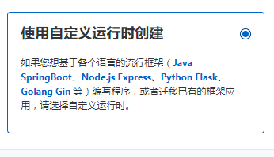
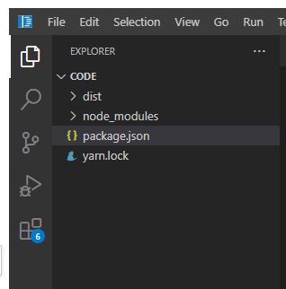

# BiliBiliStreamRequest

# 使用方法

## 自己的机器
npm install

npm run build

npm run start

## 阿里云函数
npm install

npm run build

在阿里云开个云函数，选择你想要的地区，然后创建函数

选择使用自定义运行时创建

请求处理程序类型选择 处理HTTP请求

运行环境选择 Node.js 18

创建之后，把package.json 和 dist文件夹丢进去

然后点击部署代码

选择触发器管理

所需要的网址就在 '公网访问地址'